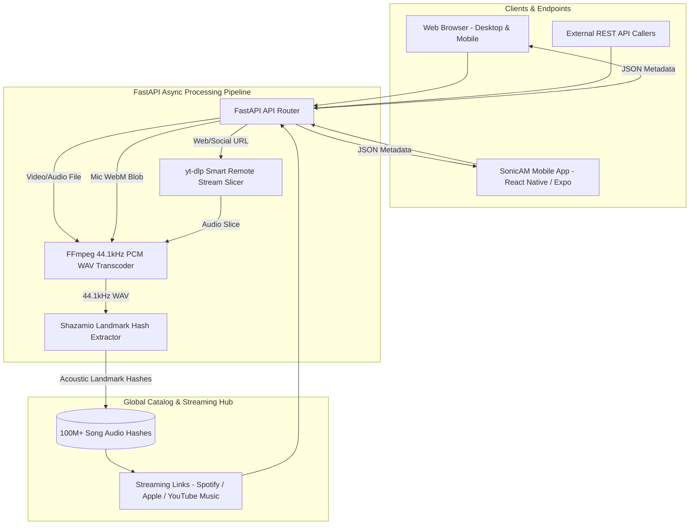

# ☕ SonicAM — Anything to Audio & Universal Song Recognition Engine (v1.2.1)

<div align="center">

[-e5a950?style=for-the-badge&logo=android&logoColor=black)](https://github.com/Mohammed-Ashraf-Shaik/anything-to-audio/releases/latest/download/SonicAM.apk)
[](https://anything-to-audio-am.vercel.app/)
[](https://huggingface.co/spaces/Mohammed-Ashraf-Shaik/SONICAM)
[-d97706?style=for-the-badge&logo=googleplay&logoColor=white)](https://github.com/Mohammed-Ashraf-Shaik/anything-to-audio/releases)
[](https://github.com/Mohammed-Ashraf-Shaik/anything-to-audio/actions/workflows/build-apk.yml)

> 🚀 **Universal APK (Phones + Tablets)**: Works natively across all existing Android phones, phablets, foldables, and tablets (`Android 7.0 Nougat` to `Android 15+`). Universal CPU support (`arm64-v8a`, `armeabi-v7a`, `x86_64`) — 100% free direct installation with no Google Play Store account required.

</div>

---

> **Extract, detect, and identify any song in seconds from social media links, video containers, raw audio tracks, or live ambient microphone — styled in a luxurious roasted coffee, mocha & warm caramel aesthetic.**


---

## 🌟 Executive Overview

**SonicAM** is an advanced, full-stack song recognition engine engineered to solve real-world music identification challenges without relying on paid APIs or restrictive monthly quotas.

Whether you have an **Instagram Reel, YouTube Short, TikTok clip, Twitter/X video, recorded video file, background audio track, or live music playing in a room**, SonicAM demuxes the media, extracts acoustic landmark fingerprints, and cross-references them with a global catalog of over **100+ million commercial songs in 1–2 seconds**.

---

## 🚀 Key Features

### 1. 🔗 Universal Social Link Detective (`yt-dlp`)
- Paste URLs directly from **YouTube, YouTube Shorts, TikTok, Instagram Reels, Twitter/X, SoundCloud, Facebook Watch, Vimeo**, or direct MP4/MP3 media streams.
- **Smart Stream Slicing**: Slices only the initial 30–45s of audio on the fly directly from the remote media stream — no multi-gigabyte video file downloads required.

### 2. 📁 Multi-Container Drag & Drop (`FFmpeg 7.1`)
- Drop any video container (`MP4`, `MKV`, `MOV`, `AVI`, `WEBM`, `FLV`, `3GP`, `WMV`) or audio format (`MP3`, `WAV`, `FLAC`, `M4A`, `OGG`, `AAC`, `OPUS`).
- Demuxes the audio stream and normalizes it to pristine **44.1kHz 16-bit stereo PCM WAV** for acoustic analysis.

### 3. 🎙️ 15-Second Ambient Live Microphone Radar
- Captures ambient audio through your browser or phone microphone with an animated radial pulse radar.
- **Feedback-Free Audio Isolation**: The microphone stream is strictly analyzed for spectrum visualization and never routed back into speakers, completely eliminating acoustic feedback shrieks.
- Supports early stop detection if you want to query before the 15-second timer completes.

### 4. 🧠 Shazam Neural Landmark Fingerprinting (`shazamio`)
- Uses reverse-engineered acoustic landmark hashing to match against Apple Music & Shazam's database.
- **Zero API Keys Required**: Operates out-of-the-box without subscriptions or billing accounts.
- **Rich Metadata Extracted**:
  - Track Title & Artist Name
  - Album, Record Label & Release Year
  - High-Resolution Cover Art (HQ)
  - 30-second High-Bitrate Audio Preview Stream
  - Synchronized Song Lyrics (when available)
  - Instant 1-Click Links to **Spotify, Apple Music, YouTube Music, and Shazam**

### 5. ☕ Luxurious Roasted Coffee & Caramel Aesthetic
- Handcrafted with warm espresso, dark mocha, roasted hazelnut, and golden caramel gradients.
- Includes a live HTML5 Canvas oscilloscope & frequency visualizer responding in real-time.

### 6. 📱 Native Mobile App (Android & iOS)
- Built with **React Native (Expo SDK 52)** featuring a hybrid WebView client architecture.
- Full microphone permissions handling, responsive offline bundle fallback, and gesture-driven UI.

### 7. 🤖 Automated GitHub Actions Android APK Builder
- Continuous integration pipeline automatically compiles a standalone, universal Android APK on every release tag or workflow dispatch.

---

## 🏗️ Architecture & Data Pipeline



---

## 📁 Repository Structure

```
anything-to-audio/
├── .github/
│   └── workflows/
│       └── build-apk.yml         # GitHub Actions automated Android APK build CI
├── backend/
│   ├── __init__.py
│   ├── config.py                 # Paths, temp directories, serverless /tmp handlers
│   ├── main.py                   # FastAPI REST application & endpoints
│   ├── media_processor.py        # yt-dlp streaming & FFmpeg normalization
│   └── recognizer.py             # Shazamio acoustic landmark fingerprinting
├── frontend/
│   ├── assets/                   # App logos & branding
│   ├── css/
│   │   └── styles.css            # Roasted coffee, mocha & caramel design system
│   ├── js/
│   │   ├── app.js                # Frontend state, API orchestration & UI handlers
│   │   └── visualizer.js         # HTML5 Canvas oscilloscope & audio visualizer
│   └── index.html                # Semantic single-page responsive application
├── mobile/
│   ├── assets/                   # App icons, splash screens & adaptive icons
│   ├── App.js                    # Native React Native WebView container
│   ├── app.json                  # Expo configuration
│   ├── eas.json                  # EAS build profiles
│   ├── index.js                  # Entry point for native bundle
│   └── package.json              # React Native dependencies
├── pyproject.toml                # Project metadata & Vercel entrypoint
├── requirements.txt              # Production Python package dependencies
└── README.md                     # System documentation
```

---

## ⚡ Quick Start (Local Development)

### 1. Clone the Repository
```bash
git clone https://github.com/Mohammed-Ashraf-Shaik/anything-to-audio.git
cd anything-to-audio
```

### 2. Set Up Python Virtual Environment
```bash
# Create virtual environment
python -m venv .venv

# Activate virtual environment
# On Windows (PowerShell):
.\.venv\Scripts\Activate.ps1
# On Linux / macOS:
source .venv/bin/activate

# Install dependencies
pip install -r requirements.txt
```

### 3. Ensure FFmpeg is Available
Make sure `ffmpeg` is installed and accessible in your system `PATH`:
- **Windows**: `winget install Gyan.FFmpeg` or download from [ffmpeg.org](https://ffmpeg.org/download.html).
- **macOS**: `brew install ffmpeg`
- **Linux (Ubuntu/Debian)**: `sudo apt update && sudo apt install ffmpeg`

### 4. Start the Development Server
```bash
python -m uvicorn backend.main:app --host 127.0.0.1 --port 8000 --reload
```
Open your browser and navigate to: **`http://127.0.0.1:8000`**

---

## 📡 REST API Reference

### 1. System Health & Diagnostics
```http
GET /api/health
```
**Response:**
```json
{
  "status": "healthy",
  "service": "SonicAM Recognition Engine",
  "ffmpeg_configured": true,
  "ffmpeg_path": "C:\ProgramData\chocolatey\bin\ffmpeg.exe",
  "temp_directory": "C:\...\temp_media",
  "allowed_formats": ["3gp", "aac", "avi", "flac", "flv", "m4a", "mkv", "mov", "mp3", "mp4", "ogg", "opus", "wav", "webm", "wmv"]
}
```

---

### 2. Recognize from Web / Social URL
```http
POST /api/recognize/url
Content-Type: application/json

{
  "url": "https://www.youtube.com/watch?v=dQw4w9WgXcQ"
}
```

---

### 3. Recognize from Uploaded File
```http
POST /api/recognize/file
Content-Type: multipart/form-data

file: <binary_file_payload (e.g. video.mp4 or audio.mp3)>
```

---

### 4. Recognize from Live Microphone Capture
```http
POST /api/recognize/mic
Content-Type: multipart/form-data

audio_blob: <binary_audio_payload (e.g. mic_capture.webm)>
```

---

### Standard Recognition Success Response
```json
{
  "success": true,
  "matched": true,
  "song": {
    "title": "Never Gonna Give You Up",
    "artist": "Rick Astley",
    "album": "Whenever You Need Somebody",
    "label": "RCA Records",
    "release_year": "1987",
    "genre": "Pop",
    "cover_art": "https://is1-ssl.mzstatic.com/image/thumb/...",
    "preview_url": "https://audio-ssl.itunes.apple.com/...",
    "has_lyrics": true,
    "lyrics": [
      "We're no strangers to love",
      "You know the rules and so do I",
      "A full commitment's what I'm thinking of",
      "You wouldn't get this from any other guy"
    ],
    "offset_seconds": 12.4,
    "links": {
      "shazam": "https://www.shazam.com/track/...",
      "spotify": "https://open.spotify.com/search/Never%20Gonna%20Give%20You%20Up%20Rick%20Astley",
      "apple_music": "https://music.apple.com/us/search?term=Never%20Gonna%20Give%20You%20Up%20Rick%20Astley",
      "youtube_music": "https://music.youtube.com/search?q=Never%20Gonna%20Give%20You%20Up%20Rick%20Astley"
    }
  },
  "source_info": {
    "source_title": "Rick Astley - Never Gonna Give You Up (Official Music Video)"
  }
}
```

---

## 📱 Mobile App (Android & iOS)

The repository contains a cross-platform mobile client in `mobile/`:

### Running the Mobile App Locally
```bash
cd mobile
npm install
npx expo start
```
- Press **`a`** to launch on an Android emulator or USB-connected device.
- Press **`i`** to launch on an iOS simulator.
- Scan the interactive QR code with **Expo Go** on your physical phone.

### Compiling Standalone Android APK (CI/CD)
1. Go to your repository on GitHub.
2. Click the **Actions** tab.
3. Select the **Build Android APK** workflow in the left sidebar.
4. Click **Run workflow** → choose `release` or `debug` mode → click **Run workflow**.
5. Once the build completes (~5–8 minutes), download the generated `.apk` artifact directly from the release page or workflow summary.

---

## ☁️ Cloud Deployment

### Deploying to Hugging Face Spaces (Docker)
SonicAM is deployed live on Hugging Face Spaces:
- URL: [https://mohammed-ashraf-shaik-sonicam.hf.space](https://mohammed-ashraf-shaik-sonicam.hf.space)
- Space: [https://huggingface.co/spaces/Mohammed-Ashraf-Shaik/SONICAM](https://huggingface.co/spaces/Mohammed-Ashraf-Shaik/SONICAM)

### Deploying to Vercel (Serverless)
The repository includes `pyproject.toml` preconfigured for Vercel's Python runtime:
```toml
[tool.vercel]
entrypoint = "backend.main:app"
```
The application dynamically routes temporary media processing to `/tmp` in serverless environments:
```bash
vercel --prod
```

---

## 📄 License & Credits

- **License**: [MIT License](LICENSE)
- **Developed by**: [Mohammad Ashraf Shaik](https://github.com/Mohammed-Ashraf-Shaik)
- **Acoustic Core**: Powered by [Shazamio](https://github.com/dotX12/Shazamio) & [yt-dlp](https://github.com/yt-dlp/yt-dlp).
