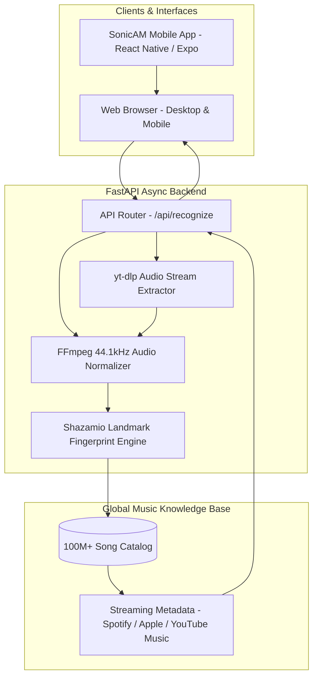

# ☕ SonicAM — Anything to Audio & Song Recognition Engine

> **Extract, detect, and identify any song in seconds from links, video files, audio tracks, or live ambient microphone — styled in a luxurious roasted coffee, mocha & warm caramel aesthetic.**


---

## 🌟 Overview

**SonicAM** is an advanced, full-stack song recognition engine engineered to solve real-world music identification challenges without relying on paid APIs or restrictive monthly quotas. 

Whether you have an **Instagram Reel, YouTube Short, TikTok clip, Twitter/X video, recorded video file, background audio track, or live music playing around you**, SonicAM demuxes the media, extracts acoustic landmark fingerprints, and cross-references them with a global catalog of over 100+ million commercial songs in 1–2 seconds.

---

## 🚀 Key Features

### 1. 🔗 Universal Social Link Detective (`yt-dlp`)
- Paste URLs from **YouTube, YouTube Shorts, TikTok, Instagram Reels, Twitter/X, SoundCloud, Facebook Watch, Vimeo**, or direct MP4/MP3 media streams.
- **Smart Stream Slicing**: Slices only the initial 30–45s of audio on the fly directly from the remote media stream — no multi-gigabyte video file downloads required.

### 2. 📁 Multi-Container Drag & Drop (`FFmpeg 7.1`)
- Drop any video container (`MP4`, `MKV`, `MOV`, `AVI`, `WEBM`, `FLV`, `3GP`, `WMV`) or audio format (`MP3`, `WAV`, `FLAC`, `M4A`, `OGG`, `AAC`, `OPUS`).
- Demuxes the audio stream and normalizes it to pristine **44.1kHz 16-bit stereo PCM WAV** for acoustic analysis.

### 3. 🎙️ 15-Second Ambient Live Microphone Radar
- Captures ambient audio through your browser or phone microphone with an animated radial pulse radar.
- **Feedback-Free Audio Isolation**: The microphone stream is strictly analyzed for spectrum visualization and never routed back into speakers, completely eliminating acoustic feedback shrieks.
- Supports early stop detection if you want to query before the 15-second timer completes.

### 4. 🧠 Shazam Neural Landmark Fingerprinting (`shazamio`)
- Uses reverse-engineered acoustic landmark hashing to match against Apple Music & Shazam's database.
- **Zero API Keys Required**: Operates out-of-the-box without subscriptions or billing accounts.
- **Rich Metadata Extracted**:
  - Track Title & Artist Name
  - Album Title, Release Year & Record Label
  - High-Definition Album Artwork
  - Playable 30-second Official Audio Preview (CORS-safe native playback)
  - Direct Streaming Links (**Spotify**, **Apple Music**, **YouTube Music**, **Shazam**)
  - Full Synchronized or Plain Lyrics (with 1-click copy)
  - Exact Acoustic Match Second Offset

### 5. ☕ Luxurious Roasted Coffee & Caramel Aesthetic
- **Dark Roast Espresso (`#0c0907`)**: Deep, low-contrast backdrop that reduces eye strain.
- **Smoked Mocha Cards (`rgba(28, 20, 15, 0.78)`)**: Frosted glassmorphism panels with soft golden borders.
- **Warm Caramel Gold (`#e5a950`) & Amber Bronze (`#d97706`)**: High-contrast interactive buttons and pulsing glow accents.
- **Cream Froth Typography (`#faf5ed` / `#c9b7a4`)**: Clean font hierarchy using Google Fonts (*Outfit*, *Space Grotesk*, and *JetBrains Mono*).
- **Dynamic Oscilloscope Canvas**: HTML5 Canvas visualizer rendering warm amber & caramel audio waves and reactive frequency bars.
- **3D Vinyl Showcase**: Animated vinyl record that smoothly spins out from the album cover during song preview playback.
- **Session History Tray**: Recent discoveries preserved across sessions via `localStorage`.

### 6. 📱 Native Mobile App (Android & iOS WebView)
- Located in `/mobile` — powered by **React Native & Expo SDK 52**.
- Full-screen native WebView loading the SonicAM web interface with notch/status bar safe area handling.
- Native Android hardware back-button history navigation (preventing accidental app exits).
- Native pull-to-refresh and network offline fallback screen.
- External streaming protocol delegation (opens native Spotify, Apple Music, and YouTube apps directly).

### 7. 🤖 Automated GitHub Actions Android APK Builder
- Workflow located at [`.github/workflows/build-apk.yml`](.github/workflows/build-apk.yml).
- Automatically builds standalone installable Android `.apk` files without needing Android Studio or local build chains.
- Uploads the resulting APK as a downloadable artifact in the GitHub Actions tab.

---

## 🏗️ Architecture



---

## 📁 Repository Structure

```
anything-to-audio/
├── .github/
│   └── workflows/
│       └── build-apk.yml         # GitHub Actions automated Android APK build CI
├── backend/
│   ├── __init__.py
│   ├── config.py                 # Environment, paths, and serverless tmp handling
│   ├── main.py                   # FastAPI application & REST endpoints
│   ├── media_processor.py        # yt-dlp streaming & FFmpeg audio normalization
│   └── recognizer.py             # Shazamio acoustic landmark fingerprinting
├── frontend/
│   ├── css/
│   │   └── styles.css            # Roasted coffee, espresso & caramel design system
│   ├── js/
│   │   ├── app.js                # Frontend state, API orchestration & UI handlers
│   │   └── visualizer.js         # HTML5 Canvas oscilloscope & spectrum visualizer
│   └── index.html                # Semantic single-page application
├── mobile/
│   ├── assets/                   # App icons, splash screens & adaptive icons
│   ├── App.js                    # Native React Native WebView container
│   ├── app.json                  # Expo mobile app configuration
│   ├── eas.json                  # EAS build profile
│   ├── index.js                  # Entry point for native bundle evaluation
│   └── package.json              # React Native dependencies
├── pyproject.toml                # Project metadata & Vercel serverless entrypoint
├── requirements.txt              # Production Python package dependencies
└── README.md
```

---

## ⚡ Quick Start (Local Development)

### 1. Clone the Repository
```bash
git clone https://github.com/Mohammed-Ashraf-Shaik/anything-to-audio.git
cd anything-to-audio
```

### 2. Set Up Python Virtual Environment
```bash
# Create virtual environment
python -m venv .venv

# Activate virtual environment
# Windows (PowerShell):
.\.venv\Scripts\Activate.ps1
# Linux / macOS:
source .venv/bin/activate

# Install dependencies
pip install -r requirements.txt
```

### 3. Start the SonicAM Development Server
```bash
python -m uvicorn backend.main:app --host 127.0.0.1 --port 8000 --reload
```

Open your browser and navigate to:
👉 **`http://127.0.0.1:8000`**

---

## 📡 REST API Reference

### 1. System Health & Diagnostics
```http
GET /api/health
```
**Response:**
```json
{
  "status": "healthy",
  "service": "SonicAM Recognition Engine",
  "ffmpeg_configured": true,
  "ffmpeg_path": "path/to/ffmpeg.exe",
  "temp_directory": "path/to/temp_media",
  "allowed_formats": ["mp4", "mkv", "mov", "avi", "webm", "mp3", "wav", "flac", "m4a", "ogg", "aac"]
}
```

### 2. Recognize from URL (YouTube, TikTok, Reels, etc.)
```http
POST /api/recognize/url
Content-Type: application/json

{
  "url": "https://www.youtube.com/watch?v=dQw4w9WgXcQ"
}
```

### 3. Recognize from Uploaded File (Video or Audio)
```http
POST /api/recognize/file
Content-Type: multipart/form-data

file: <binary_file_payload>
```

### 4. Recognize from Live Microphone Capture
```http
POST /api/recognize/mic
Content-Type: multipart/form-data

audio: <binary_webm_audio_payload>
```

**Success Response Payload Example:**
```json
{
  "success": true,
  "data": {
    "title": "Never Gonna Give You Up",
    "artist": "Rick Astley",
    "album": "Whenever You Need Somebody",
    "release_year": "1987",
    "label": "RCA Records",
    "genre": "Pop",
    "cover_art": "https://is1-ssl.mzstatic.com/image/thumb/...",
    "preview_url": "https://audio-ssl.itunes.apple.com/...",
    "offset_seconds": 12.4,
    "lyrics": "We're no strangers to love\nYou know the rules and so do I...",
    "streaming": {
      "spotify": "https://open.spotify.com/track/...",
      "apple": "https://music.apple.com/...",
      "ytmusic": "https://music.youtube.com/search?q=...",
      "shazam": "https://www.shazam.com/track/..."
    }
  }
}
```

---

## 📱 Mobile App (Android & iOS)

### Running the Mobile App Locally
```bash
cd mobile
npm install
npx expo start
```
- Press **`a`** to open on an Android emulator or connected device.
- Press **`i`** to open on an iOS simulator.
- Scan the terminal QR code with the **Expo Go** app on your physical device.

### Building Standalone Android APK with GitHub Actions
1. Navigate to your repository on GitHub.
2. Click the **Actions** tab.
3. In the left sidebar, click **Build Android APK**.
4. Click **Run workflow** &rarr; select build type (`release` or `debug`) &rarr; click **Run workflow**.
5. Once the build completes (~5–8 minutes), download the standalone `.apk` artifact directly from the run summary.

---

## ☁️ Deployment

### Deploying to Vercel
The project includes a `pyproject.toml` preconfigured for Vercel's Python runtime:
```toml
[tool.vercel]
entrypoint = "backend.main:app"
```
The application dynamically routes temporary audio processing to `/tmp` in serverless environments, making deployment seamless:
```bash
vercel --prod
```

---

## 📄 License

Distributed under the **MIT License**. Created by [Mohammed Ashraf Shaik](https://github.com/Mohammed-Ashraf-Shaik).
